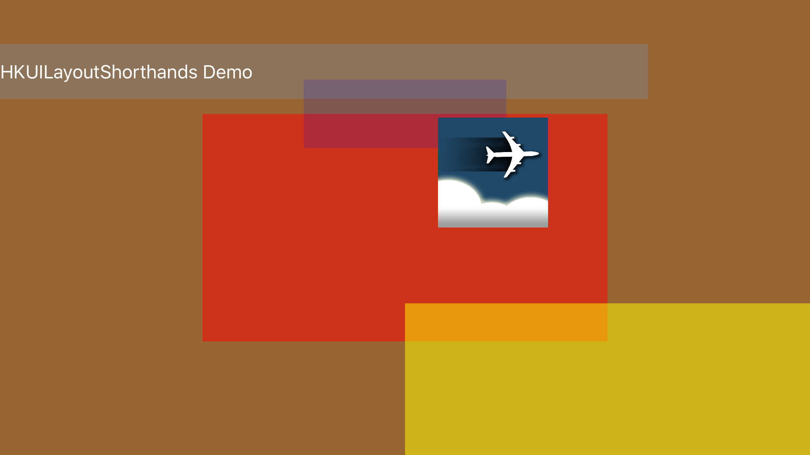
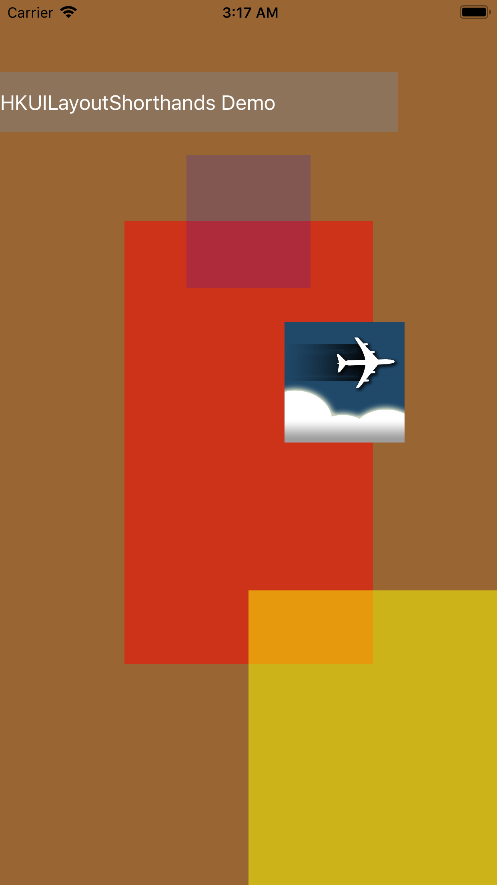
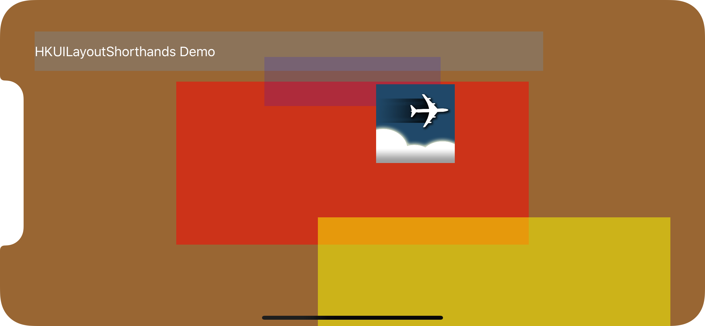
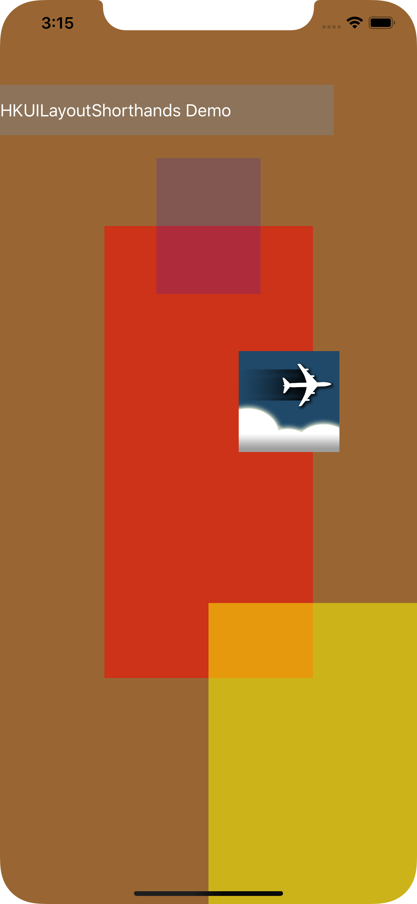

# HKUILayoutShorthandsDemo
#### Demo Application for shorthand methods for Swift programmatic UI layout constraints

## INTRODUCTION

This is a demo application for shorthand methods for Swift programmatic UI layout constraints.

All the layout codes reside in the `viewDidLoad()` method of the `ViewController` and creates a moasic that is reminiscent of Frank Lloyd Wright's tileworks. The syntax that calls the layout shorthands all start with `anchor`. The syntax is so easy to read it needs no comments. The demo app creates 3 UIViews, an UILabel and an UIImage.

   

In the landscape mode of the iPhone XS and later models with the notch and no home button, it is aware of the safe area of the screen by leaving margins to the sides:

   

For documentation of the module **HKUILayoutShorthands**, go to https://github.com/harrisonkong/HKUILayoutShorthands

## SETUP

Simply clone the demo application and build and run. It requires iOS 11 and above and Swift 4.0 and above.
